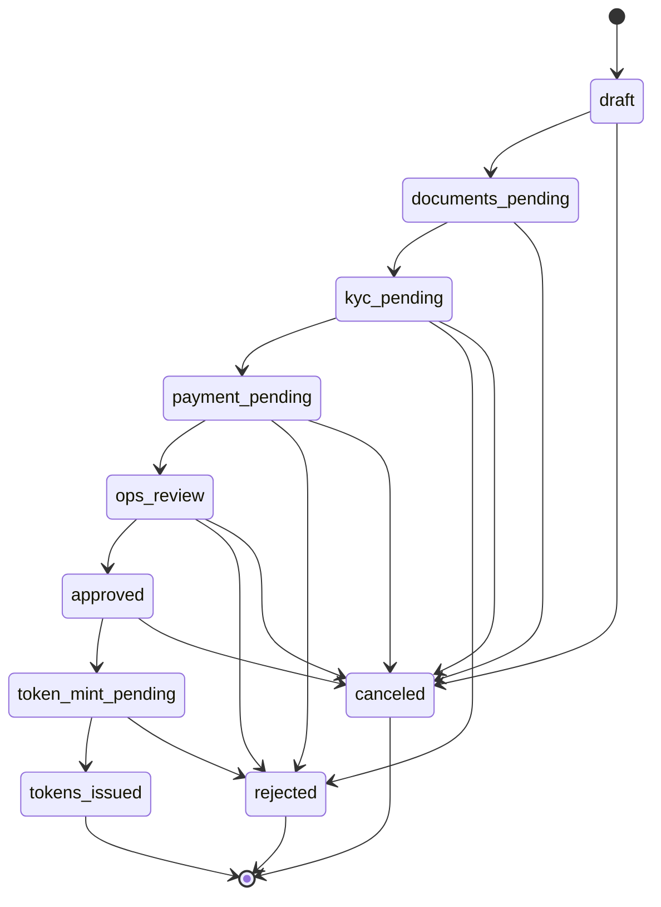

# Investor Subscription Domain Model

This is the backend data model for MPC Private Access investor onboarding and subscription.

## Entities

| Entity | Purpose | Key relationships |
|---|---|---|
| `Investor` | Legal person or natural person applying for access | Has many `Wallet`, `KycCase`, `AmlScreening`, `Subscription`, `DocumentAcceptance` |
| `Wallet` | Investor-controlled or custodial wallet address | Belongs to one `Investor`; linked to on-chain `IdentityRegistry` when verified |
| `KycCase` | KYC review lifecycle and provider reference | Belongs to one `Investor`; can approve eligibility claims |
| `AmlScreening` | Sanctions / PEP / adverse media screening | Belongs to one `Investor`; informs claim issuance and ops review |
| `Deal` | Tokenized private-market opportunity | Has one or more `Offering` records |
| `Offering` | Concrete subscription window and terms | Belongs to one `Deal`; has many `Subscription` records |
| `Subscription` | Investor request to subscribe to an offering | Belongs to one `Investor`, one `Offering`, one `Wallet`; links to `Payment` and `TokenAllocation` |
| `Payment` | SEPA/payment reconciliation record | Belongs to one `Subscription` |
| `TokenAllocation` | Reserved/minted token amount | Belongs to one `Subscription`; references token mint transaction |
| `DocumentAcceptance` | Acceptance of subscription documents / risk notices | Belongs to one `Investor`; can be scoped to `Deal`, `Offering`, or `Subscription` |
| `AuditLog` | Immutable operational action log | References actor, entity type/id, action, before/after metadata |

## Statuses

Core statuses are defined in `src/subscriptions/domain.js`:

- `InvestorType`: `retail`, `professional`, `semi_professional`
- `WalletStatus`: `pending_verification`, `verified`, `rejected`, `revoked`
- `KycStatus`: `not_started`, `in_review`, `approved`, `rejected`, `expired`
- `AmlStatus`: `not_screened`, `clear`, `review_required`, `blocked`
- `OfferingStatus`: `draft`, `open`, `paused`, `closed`, `settled`, `canceled`
- `SubscriptionStatus`: `draft`, `documents_pending`, `kyc_pending`, `payment_pending`, `ops_review`, `approved`, `token_mint_pending`, `tokens_issued`, `rejected`, `canceled`
- `PaymentStatus`: `pending`, `received`, `failed`, `refunded`
- `TokenAllocationStatus`: `reserved`, `mint_pending`, `minted`, `failed`, `canceled`
- `DocumentAcceptanceStatus`: `pending`, `accepted`, `superseded`, `revoked`

## Subscription State Transitions

## GDPR Boundary

Personal and sensitive evidence stays off-chain and outside token contracts.

| Data class | Examples | Storage boundary |
|---|---|---|
| Investor personal data | legal name, date of birth, address, email, phone | Backend database only, access-controlled |
| Sensitive evidence | identity documents, proof of address, KYC/AML provider payloads, suitability questionnaire | Backend/provider vault only, never on-chain |
| Operational data | investor id, wallet address, deal id, subscription status, payment status | Backend database, audit log |
| On-chain claims | wallet address, identity anchor, claim topic, claim issuer, claim validity | On-chain registries/events, no personal data |

## Link To Tokenization

Only after `SubscriptionStatus.APPROVED` may the backend move to `TOKEN_MINT_PENDING` and call the tokenization backend service. The chain write must reference an `offchainRef` that points to the subscription/audit record without exposing personal data.
